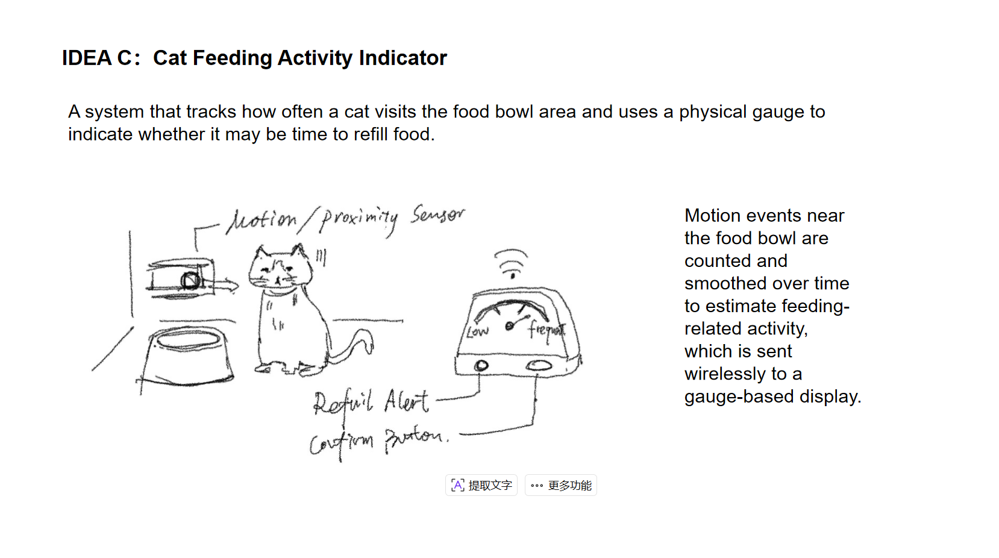

# Cat Feeding Activity Indicator

This project tracks how often a cat visits the food bowl area using a motion sensor. Feeding-related activity is estimated over time and shown on a physical gauge display to indicate when it may be time to refill food.

## Sensor Device

The sensing device is placed near the cat’s food bowl to detect when the cat approaches the feeding area. It captures feeding-related activity by monitoring motion events around the bowl over time.

**Hardware Components**
- Microcontroller: ESP32-C3
- Motion / Proximity Sensor: PIR Motion Sensor (HC-SR501)
- Power: LiPo Battery (500–1000 mAh)
- Additional components: Power switch, voltage regulator

When motion is detected near the food bowl, the sensor sends a signal to the ESP32 microcontroller. The microcontroller counts motion events and records them over time. Basic preprocessing is performed locally before the activity data is sent wirelessly to the display device.

The sensing device is battery-powered and enclosed in a compact housing that can be mounted near the food bowl without disturbing the cat.

## Display Device

## System Architecture