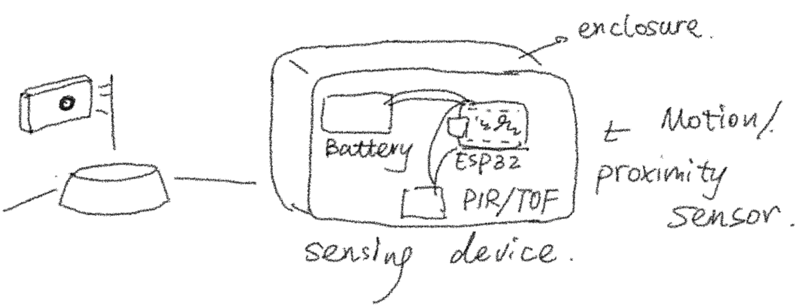
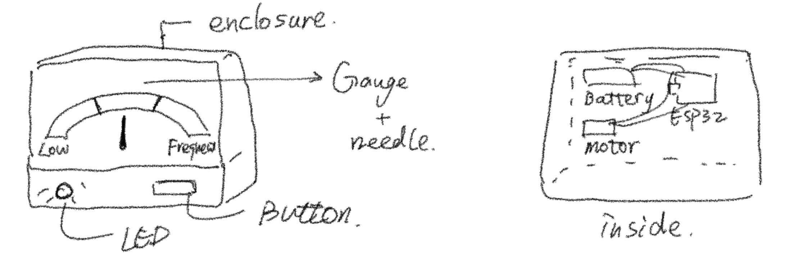
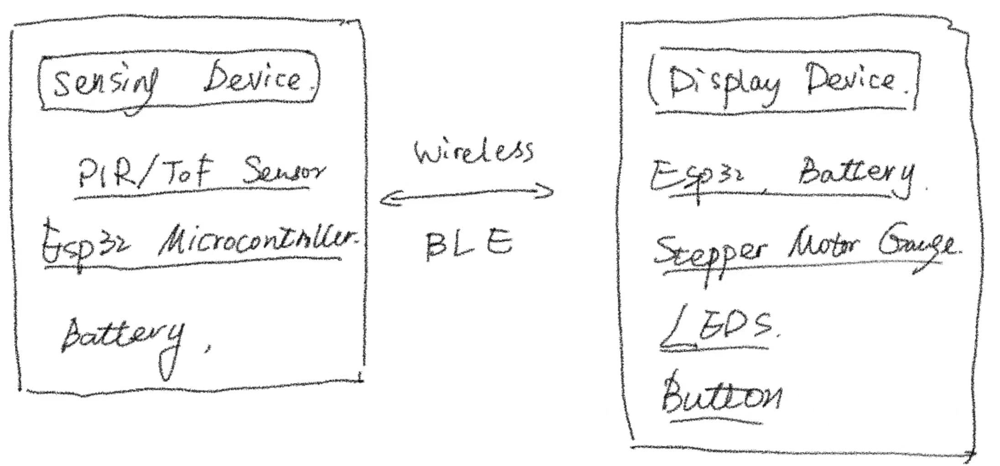
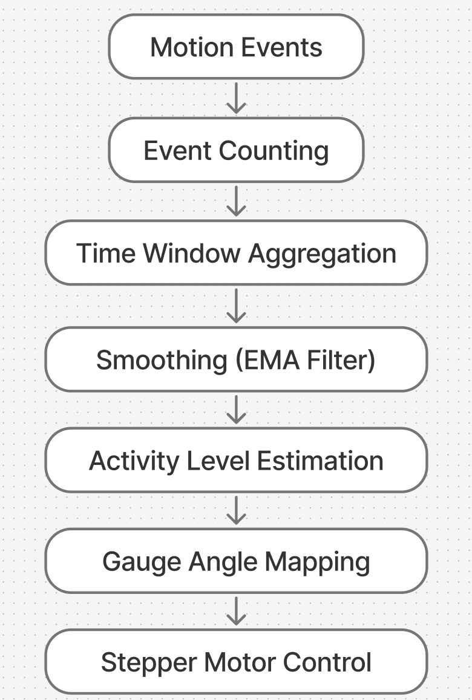
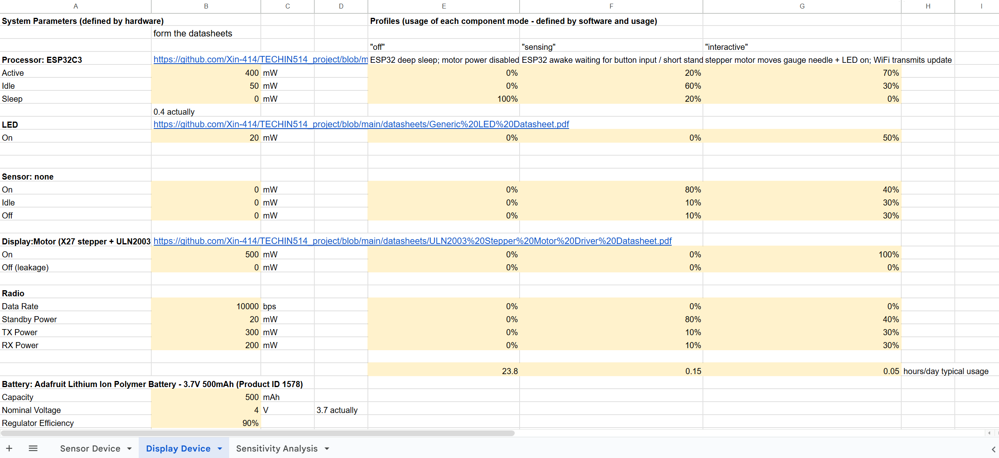

# Cat Feeding Activity Indicator

This project tracks how often a cat visits the food bowl area using a motion sensor. Feeding-related activity is estimated over time and shown on a physical gauge display to indicate when it may be time to refill food.

## Sensor Device

The sensing device is placed near the cat’s food bowl to detect when the cat approaches the feeding area. It captures feeding-related activity by monitoring motion events around the bowl over time.

**Hardware Components**
- Microcontroller: ESP32-C3
- Motion / Proximity Sensor: PIR Motion Sensor (HC-SR501)
- Power: LiPo Battery (500–1000 mAh)
- Additional components: Power switch, voltage regulator

When motion is detected near the food bowl, the sensor sends a signal to the ESP32 microcontroller. The microcontroller counts motion events and records them over time. Basic preprocessing is performed locally before the activity data is sent wirelessly to the display device.

The sensing device is battery-powered and enclosed in a compact housing that can be mounted near the food bowl without disturbing the cat.

*Figure: Detailed sketch of the sensing device placed near the food bowl, showing the motion/proximity sensor, ESP32 microcontroller, battery, and enclosure.*

## Display Device

The display device provides a physical and intuitive visualization of the cat’s feeding-related activity. It translates processed activity data into a gauge-based display that allows the user to quickly understand when it may be time to refill the food bowl.

**Hardware Components**
- Microcontroller: ESP32-C3
- Stepper Motor: 28BYJ-48 stepper motor with ULN2003 driver
- LEDs: Single or multiple LEDs for status indication
- Button: Tactile push button for refill confirmation
- Power: LiPo Battery (1000–2000 mAh)
- Enclosure: Custom desktop enclosure for gauge display

The ESP32 microcontroller receives activity data wirelessly from the sensing device. Based on the received activity level, the microcontroller controls the stepper motor to rotate the gauge needle to the appropriate position. Higher feeding-related activity moves the needle closer to the “refill” zone.

LEDs provide additional visual feedback, such as indicating normal operation or alerting the user when a refill is recommended. A physical button allows the user to confirm that food has been refilled, which resets the gauge and activity state. The display device is battery-powered and designed as a standalone, easily visible desktop object.

*Figure: Sketch of the display device showing the gauge driven by a stepper motor, LED indicators, a user button, internal ESP32 microcontroller, battery, and enclosure.*

## System Architecture

The system consists of two main components: a sensing device placed near the cat’s food bowl and a separate display device that visualizes feeding-related activity. These two devices communicate wirelessly to form a distributed sensing and display system.

*Figure: System-level diagram showing wireless communication between the sensing device and the display device.*

The sensing device detects motion events near the food bowl using a motion or proximity sensor. An ESP32 microcontroller counts these events and aggregates them over time. Basic preprocessing is performed locally before the activity data is transmitted wirelessly to the display device.

  
*Figure: Data and algorithm flow from raw motion events to physical gauge movement.*

Motion events are accumulated within a time window and smoothed using a simple digital signal processing technique, such as an exponential moving average (EMA), to reduce noise and short-term fluctuations. The resulting activity level is mapped to a corresponding gauge angle. The display device receives this value and controls a stepper motor to move the gauge needle accordingly. LEDs provide additional status feedback, and a button allows the user to confirm food refilling and reset the system state.

## Power & Battery Analysis

### Spreadsheet
Google Sheets (view-only):  
https://docs.google.com/spreadsheets/d/10LHwdyrkDoTDUunTCcTbiJU-1OUqTOgCYg1e28etRiU/edit?usp=sharing

### Screenshots
- Sensor Device Power Model  
  

- Display Device Power Model  
