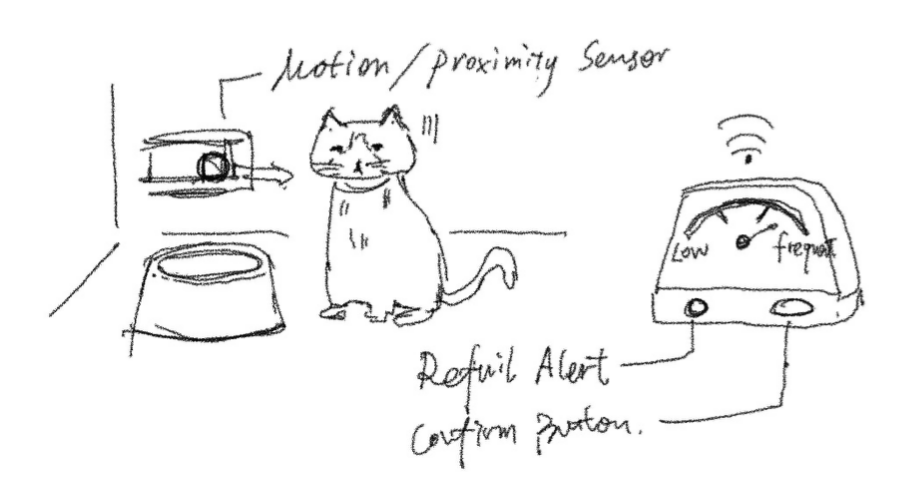
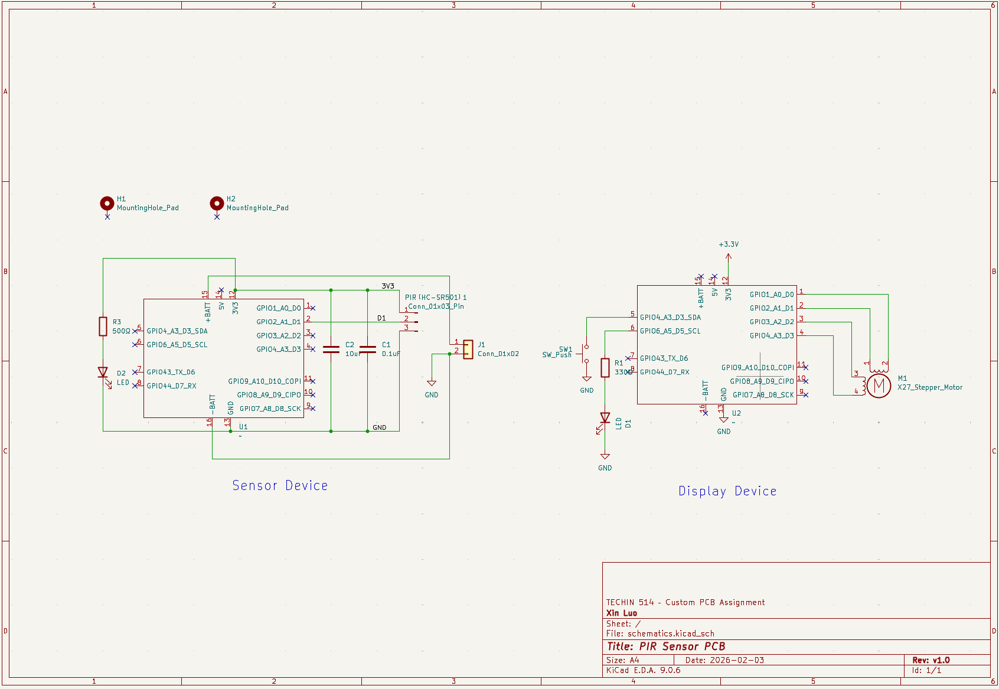
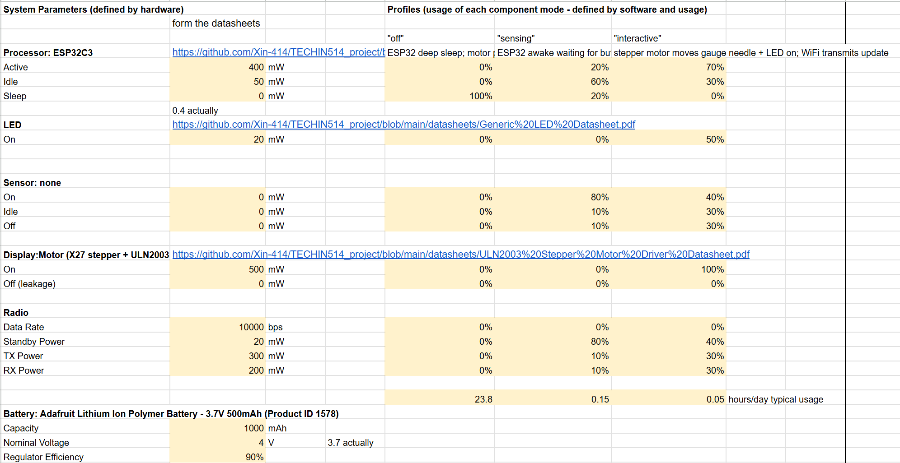
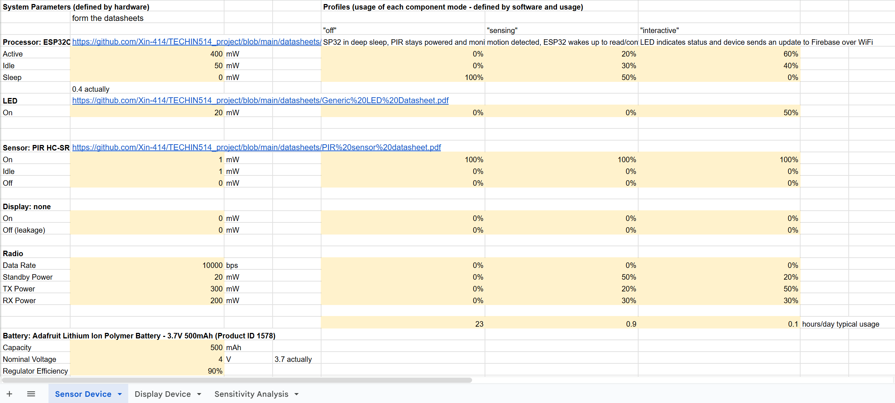

# Cat Feeding Activity Indicator

A connected device system that monitors how frequently a cat visits its food bowl and provides a physical gauge display to indicate when it may be time to refill the food.

This project was developed for TECHIN 514.

---

## Overview

Cat owners often do not know when their cat’s food bowl needs refilling. Cats may repeatedly visit an empty bowl without the owner noticing.

This project addresses this problem by monitoring motion near the food bowl and visualizing feeding-related activity through a physical gauge display.

*Figure: Design sketches.*

The system consists of two connected devices:  
• **Sensor Device** – detects cat motion near the food bowl  
• **Display Device** – visualizes feeding activity using a gauge needle and LED indicator

When the cat frequently approaches the bowl, the system indicates that the bowl may need refilling.

---

## System Architecture

The system includes two ESP32-based devices communicating wirelessly using **ESP-NOW**.

Workflow:

PIR Motion Detection  
→ Event Debounce Filtering  
→ Activity Counter  
→ Wireless Transmission (ESP-NOW)  
→ Gauge Needle Rotation  
→ LED Alert

---

## Hardware Components

### Sensor Device

Placed near the cat’s food bowl.

Components:
- PIR Motion Sensor (HC-SR501)
- Seeed XIAO ESP32-S3
- Capacitors
- Resistor
- USB-C power

Function:

Detects motion events near the food bowl and sends activity counts wirelessly to the display device.

---

### Display Device

Placed in a visible location for the owner.

Components:  
- Seeed XIAO ESP32-C3
- X27.168 bipolar stepper motor gauge
- LED indicator
- Push button switch
- 330Ω resistor
- 3.7V 1000mAh LiPo battery

Function:

Receives activity data and maps it to a gauge needle position that indicates feeding activity level.

---
## Schematics & PCB layout

The system includes custom circuit schematics and PCB layout for both sensing and display devices.

*Figure: Schematics*

*Figure: PCB layout of sensor device.*

## Signal Processing

Motion signals from the PIR sensor are filtered using a debounce time window to avoid multiple triggers from a single visit.

Processing pipeline:  

During testing, the system detected **18 out of 20 simulated bowl visits**, resulting in an estimated **90% detection accuracy**. :contentReference[oaicite:0]{index=0}

---

## Demo

Demo video: https://drive.google.com/file/d/1uZkeXHpC4BiWEvxUYPUGvsP9ljvaZRCp/view

---

## Battery Considerations

The display device is powered by a **3.7V 1000mAh LiPo battery**.

Battery life estimation was calculated based on:

- ESP32 power consumption  
- LED activity  
- Stepper motor usage  
- Communication duty cycle

Power analysis was used to determine expected operating duration and ensure reliable device operation.

### Spreadsheet
Google Sheets (view-only):  
https://docs.google.com/spreadsheets/d/10LHwdyrkDoTDUunTCcTbiJU-1OUqTOgCYg1e28etRiU/edit?usp=sharing

### Screenshots
- Display Device Power Model  
  
- Sensor Device Power Model  
  

---

## Budget Summary

| Component | Quantity | Cost |
|-----------|----------|------|
| ESP32-C3 | 2 | $21.98 |
| LiPo Battery | 2 | $15.90 |
| PIR Motion Sensor | 1 | — |
| X27 Stepper Motor | 1 | — |
| Other components (resistors, LEDs, capacitors) | — | — |

Total project cost is approximately **$40–50** depending on sourcing and additional components.

---

## Future Work

Possible future improvements include:

**Behavior-aware detection**  
Improve sensing reliability and reduce false triggers caused by nearby motion.

**Machine learning analysis**  
Use motion pattern analysis to distinguish feeding behavior from other movement near the bowl.

**Multi-device ecosystem**  
Support multiple food bowls or multiple pets by connecting additional sensor devices.

**Data logging and mobile interface**  
Store feeding activity data and visualize it through a mobile application or dashboard.
